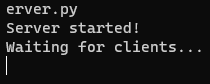
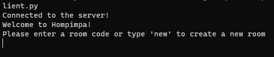
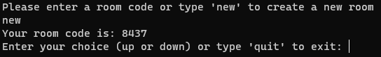
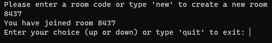
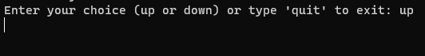
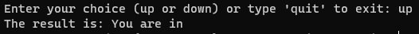
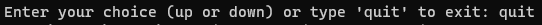

# Cara Bermain Hompimpa Python  
by Kelompok 4  
 

1. jalankan server.py pada terminal (dengan membuka terminal pada direktori server.py)  
   
   

2. buka terminal lain pada direktori yang sama, jalankan client.py  
   

3. Jika anda ingin membuat room baru, ketikkan "new" pada terminal client.py  
   

4. Jika anda ingin bergabung ke room yang sudah ada, ketikkan nomor ruangan yang telah dibuat sebelumnya pada terminal client.py  
   

5. Setelah bergabung ke suatu ruangan (room), anda dapat memilih antara up (atas) atau down (bawah) pada terminal client.py  
   

6. Jika semua player telah memilih, maka akan muncul hasilnya pada terminal client.py  
   
   
   *Jika terdapat player yang belum memilih, permainan tidak akan dimulai. Sehingga lebih baik menunggu semua player join terlebih dahulu sebelum memilih up atau down.

7. Jika anda ingin keluar dari permainan, ketikkan "exit" pada terminal client.py  
   